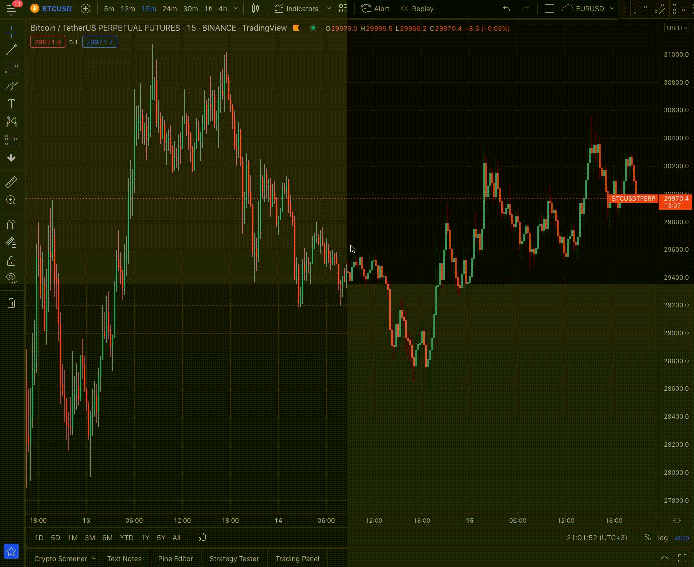
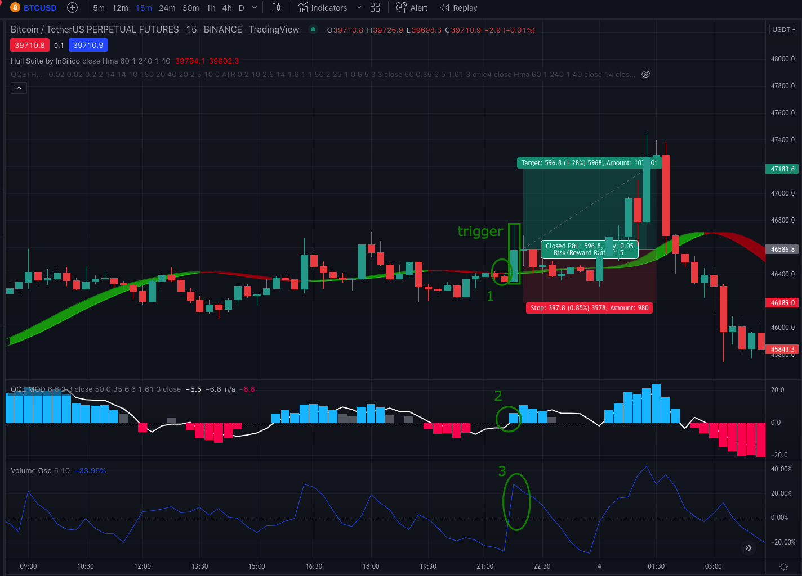
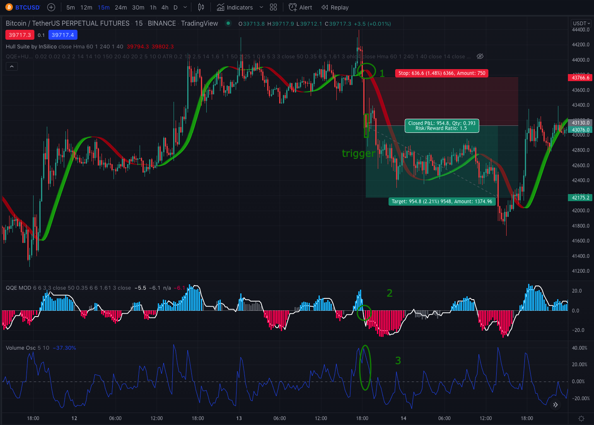
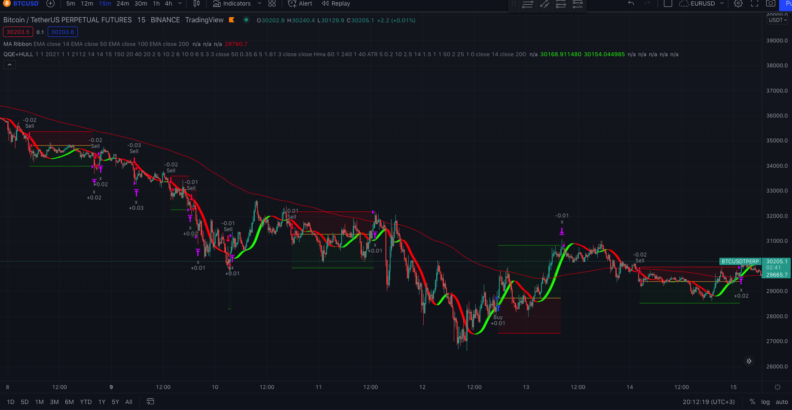
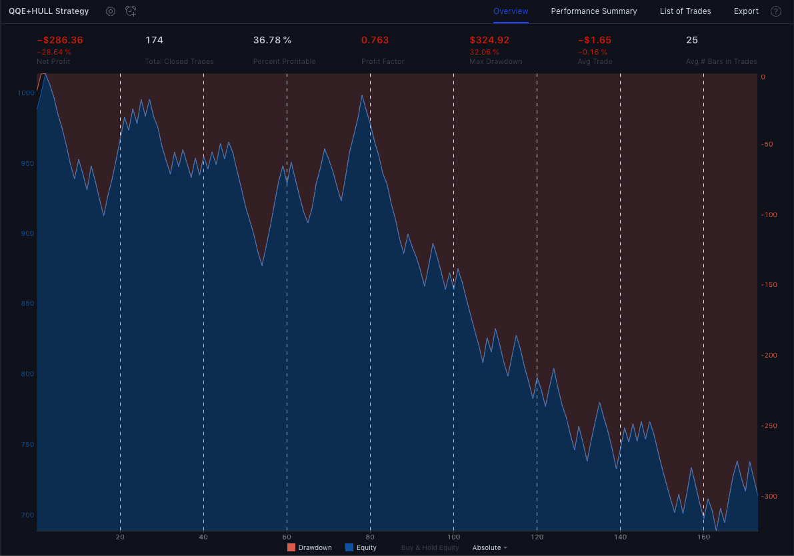
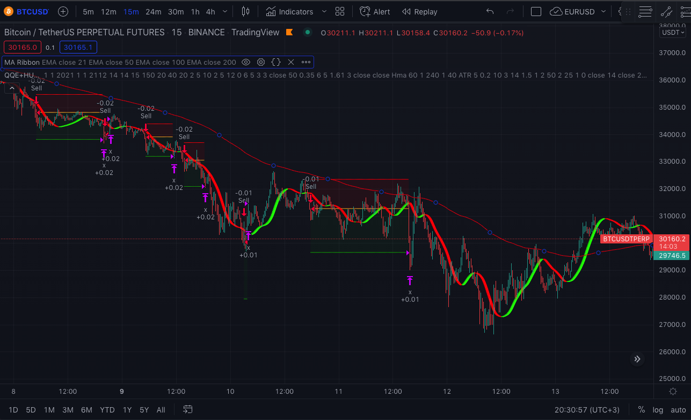
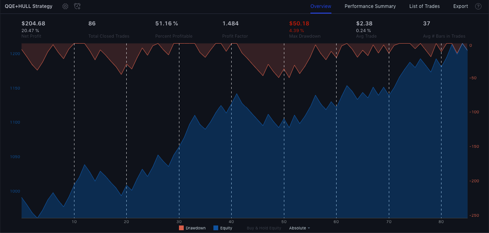
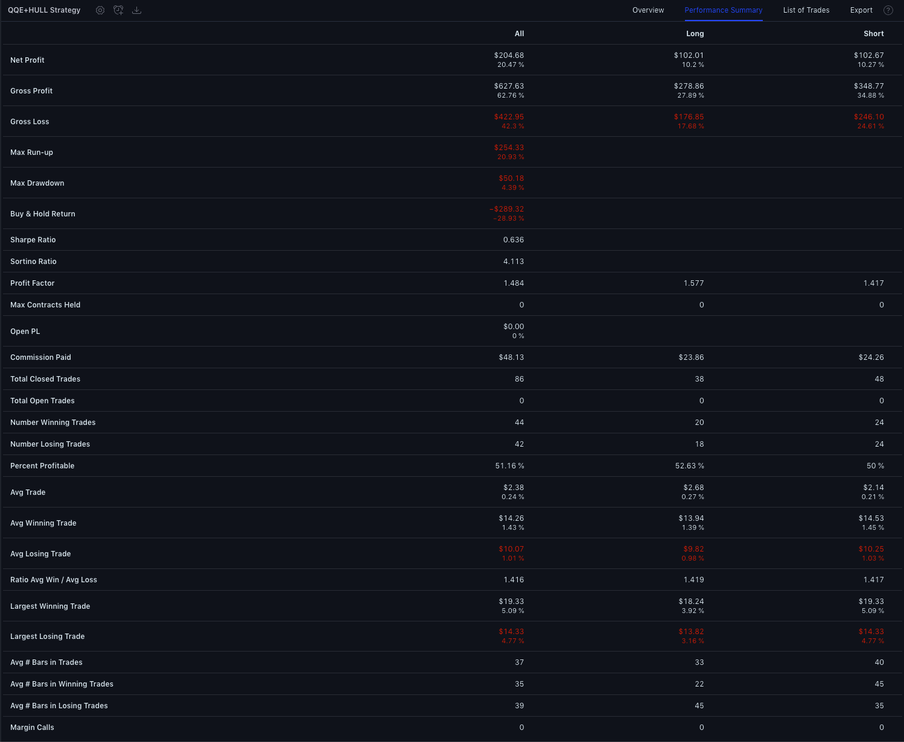

This is my first post on my new blog! How exciting!

I am glad to present you the first strategy that I recently tested.
I found <a target="_blank" rel="noopener noreferrer" href="https://www.youtube.com/watch?v=wwmv6TU7dzU">this strategy&nbsp;</a> at TradeIQ channel.

By the results of 100 tests the author's strategy showed winrate 69% 🤩 and PnL 310% 🤑. 

It looks impressive. Let's check how this strategy will work on BTCUSDT pair.

## Indicators.
* [QQE MOD](https://www.tradingview.com/script/TpUW4muw-QQE-MOD/)
First confirmation indicator.

* [HULL SUITE](https://www.tradingview.com/v/hg92pFwS/)
Second confirmation indicator.

* [Volume Oscilator](https://www.tradingview.com/support/solutions/43000591350-volume-oscillator/)
Volume indicator to confirm volume increase.

* <a target="_blank" rel="noopener noreferrer" href="https://ru.tradingview.com/script/ziTzsSfo-ATR-Bands/">ATR Bands&nbsp;</a> Used for determining Stop Loss level

## Indicator settings
* HULL SUITE
Change Length to 60

Leave the rest as is.

## Signals

### Long

* New BLUE histogram appeard
* HULL must be green and price has to be closed above it.
* Volume Oscilator must be greater than zero percent.

When all conditions met we open LONG position after TRIGGER candle closed.
Set Stop Loss below recent swing low and target Take Profit 1.5 the risk.

### Short

* New RED histogram appeard
* HULL must be red and price has to be closed below it.
* Volume Oscilator must be greater than zero percent.

When all conditions met we open LONG position after TRIGGER candle closed.
Set Stop Loss below recent swing low and target Take Profit 1.5 the risk.

## Backtest
* Ticker: BTCUSDTPERP
* Timeframe: 15m
* Duration: 4 months

* Initial capital: 1000 USDT
* Risk per trade: 1% of account
* Stop Loss: ATR 14; Multiplier: 3
* Take Profit Type: Risk/Reward
* Risk/Reward ratio: 1.5

First result:

Let's try to optimize. 

## Optimization

The main drawback of this strategy is that it often opens trades against the main trend. Let's fix it with [EMA] and [SuperTrend]. And also let's filter trades that are opened in low volatility market with <a target="_blank" rel="noopener noreferrer" href="https://ru.tradingview.com/script/VTPMMOrx-ADX-and-DI">ADX</a>.

Additional filters:
* ADX > 15
* Close price is higher than EMA 200
* Green SuperTrend (Period:14; Factor: 5;)  
I decided to add this indicator because the EMA 200 filtering had one downside. We were getting false signals during sideways price movements. After adding SuperTrend the number of losing signals became less, while the number of winning signals remained almost unchanged.

## Conclusion

Initially the strategy was not as profitable as the author promised but as we can see the optimization has improved the profitability of the strategy and increased the winrate by 16% from 36.7% to 51%. 
Next time we will backtest the strategy based on PSAR and RSI.