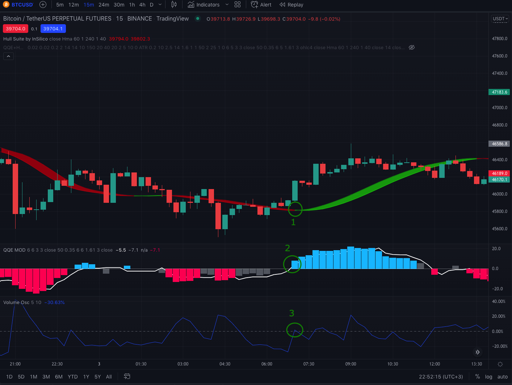

This is my first post on my new blog! How exciting!

I am glad to present you the first strategy that I recently tested.
I found this strategy at TradeIQ channel.
[embed video https://www.youtube.com/watch?v=wwmv6TU7dzU]

Первые результаты были не очень впечатляющими, но после оптимизации стали выглядеть неплохо.

(вставить картинку с финальными резульяттами)

Но обо всем по порядку.

## Indicators
* [QQE MOD](https://www.tradingview.com/script/TpUW4muw-QQE-MOD/)
>The Qualitative Quantitative Estimation (QQE) indicator works like a smoother version of the popular Relative Strength Index (RSI) indicator. QQE expands on RSI by adding two volatility based trailing stop lines. These trailing stop lines are composed of a fast and a slow moving Average True Range (ATR).

* [HULL SUITE](https://www.tradingview.com/v/hg92pFwS/)
>Hull is its extremely responsive and smooth moving average created by Alan Hull in 2005.
Minimal lag and smooth curves made HMA extremely popular TA tool.

* [Volume Oscilator]
>Осциллятор объема — индикатор, показывающий разность между двумя скользящими средними объема торгов.

## Настройки индикаторов
* QQE MOD (По умолчанию)
* HULL SUITE
Length: 60
* Volume Oscilator (По умолчанию)

## Rules
Сигналы для входа:
* long: гистограмма QQE изменила цвет на синий
* short: гистограмма QQE изменила цвет на красный

Фильтры:
* long: Hull MA имеет цвет зеленый
* short: Hull MA имеет цвет красный

* long: Volume Osculator > 0
* short: Volume Osculator > 0

Фильтр применяется после сигнала для того что бы улучшить его качество. Для того что бы сигнал считался валидным, все фильтры должны проходить.

## Примеры входов

### Long

1) QQE MOD начал рисовать синюю гистограмму
2) HULL имеет цвет зеленый
3) Volume Oscilator показывает объем больше 0%

Открывем сделку после закрытия trigger свечи со stop loss по уровню ATR(14) * 3 (0.85%) и Take Profit x1.5 (1.28%)

Сигнал получился довольно неплохой.

### Short

1) QQE MOD начал рисовать синюю гистограмму
2) HULL имеет цвет зеленый
3) Volume Oscilator показывает объем больше 0%

Открывем сделку после закрытия trigger свечи со stop loss по уровню ATR(14) * 3 (1.48%) и Take Profit x1.5 (2.21%)

Сигнал получился не очень хороший. Мы получили его фактически на ретесте ближайшего уровня поддержки, после чего было небольшое коррекционное движение, которое могло закончиться не в нашу пользу. Во-вторых из-за того что Stop Loss был высоко, TP пришлось ставить ниже уровня поддержки. Если бы мы его не пробили, сделка закрылась бы в минус. При реальной торговли я бы не стал открывать данную сделку.

### Плохой сигнал 


Почему данный сигнал не считается корректным?

1) QQE MOD сменил цвет на синий - ОК (emoji)
2) HULL на данной свечке имеет красный цвет. Меняется на зеленый он только на следущей - Не ОК. [emoji]
3) Volume Oscilator незначительно превышает 0% - Не ОК. [emoji]

## Backtest
* Ticker: BTCUSDTPERP
* Timeframe: 15m
* Duration: 4 months

* Начальный капитал: 1000 USDT
* Risk per trade: 1% от аккаунта
* Stop Loss: ATR(14); ATR Multiplier: 3
* Take Profit Type: Risk/Reward
* Risk/Reward ratio: 1.5

Первый результаты:


С учетом того, что сратегия не слила депозит, можно считать для нее еще не все потеряно. Попробуем оптимизировать.

## Оптимизация

Дополнительные фильтры:
* ADX > 11 (ссылка)
* Цена закрытия выше чем ema(200) (ссылка на EMA)
* ATR Multiplier: 2.45
* Risk/Reward: x1.6
* Отключен volume oscilator
* Максимальный Stop Loss 6000 пунктов


Как мы видим оптимизаци значительно повысила Profit Factor. Очень большое значение сыграл фильтр по Stop Loss. Из за ATR тот иногда был непомерно большим, что приводило к тому, что Take Profit был тоже огромный. Мы избавились от подобных сделок. Так же мы отфильтовали сигналы по тренду, что позволило получить WINRATE 66%, что очень и очень хорошо.

```js
const saltyDuckEgg = "chinese preserved food product"
```

| Number | Title                                    | Year |
| :----- | :--------------------------------------- | ---: |
| 1      | Harry Potter and the Philosopher’s Stone | 2001 |
| 2      | Harry Potter and the Chamber of Secrets  | 2002 |
| 3      | Harry Potter and the Prisoner of Azkaban | 2004 |

[View raw (TEST.md)](https://raw.github.com/adamschwartz/github-markdown-kitchen-sink/master/README.md)

This is a paragraph.

    This is a paragraph.

# Header 1

## Header 2

    Header 1
    ========

    Header 2
    --------

# Header 1

## Header 2

### Header 3

#### Header 4

##### Header 5

###### Header 6

    # Header 1
    ## Header 2
    ### Header 3
    #### Header 4
    ##### Header 5
    ###### Header 6

# Header 1

## Header 2

### Header 3

#### Header 4

##### Header 5

###### Header 6

    # Header 1 #
    ## Header 2 ##
    ### Header 3 ###
    #### Header 4 ####
    ##### Header 5 #####
    ###### Header 6 ######

> Lorem ipsum dolor sit amet, consectetuer adipiscing elit. Aliquam hendrerit mi posuere lectus. Vestibulum enim wisi, viverra nec, fringilla in, laoreet vitae, risus.

    > Lorem ipsum dolor sit amet, consectetuer adipiscing elit. Aliquam hendrerit mi posuere lectus. Vestibulum enim wisi, viverra nec, fringilla in, laoreet vitae, risus.

> ## This is a header.
>
> 1. This is the first list item.
> 2. This is the second list item.
>
> Here's some example code:
>
>     Markdown.generate();

    > ## This is a header.
    > 1. This is the first list item.
    > 2. This is the second list item.
    >
    > Here's some example code:
    >
    >     Markdown.generate();

- Red
- Green
- Blue

* Red
* Green
* Blue

- Red
- Green
- Blue

```markdown
- Red
- Green
- Blue

* Red
* Green
* Blue

- Red
- Green
- Blue
```

- `code goes` here in this line
- **bold** goes here

```markdown
- `code goes` here in this line
- **bold** goes here
```

1. Buy flour and salt
1. Mix together with water
1. Bake

```markdown
1. Buy flour and salt
1. Mix together with water
1. Bake
```

1. `code goes` here in this line
1. **bold** goes here

```markdown
1. `code goes` here in this line
1. **bold** goes here
```

Paragraph:

    Code

<!-- -->

    Paragraph:

        Code

---

---

---

---

---

    * * *

    ***

    *****

    - - -

    ---------------------------------------

This is [an example](http://example.com "Example") link.

[This link](http://example.com) has no title attr.

This is [an example][id] reference-style link.

[id]: http://example.com "Optional Title"

    This is [an example](http://example.com "Example") link.

    [This link](http://example.com) has no title attr.

    This is [an example] [id] reference-style link.

    [id]: http://example.com "Optional Title"

_single asterisks_

_single underscores_

**double asterisks**

**double underscores**

    *single asterisks*

    _single underscores_

    **double asterisks**

    __double underscores__

This paragraph has some `code` in it.

    This paragraph has some `code` in it.


    
